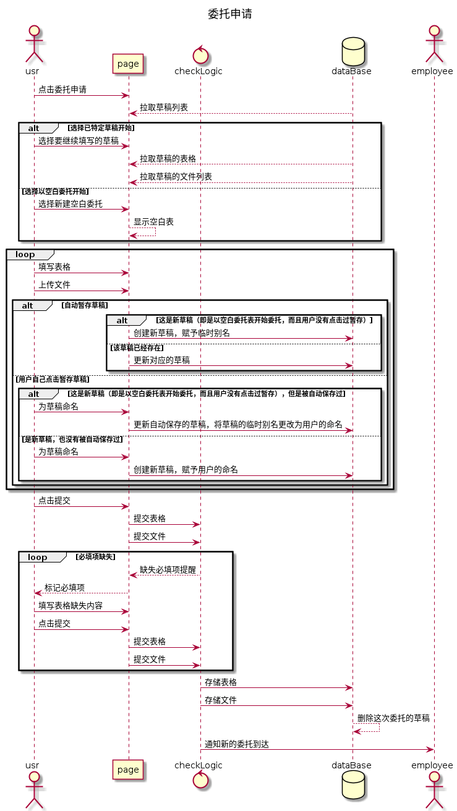
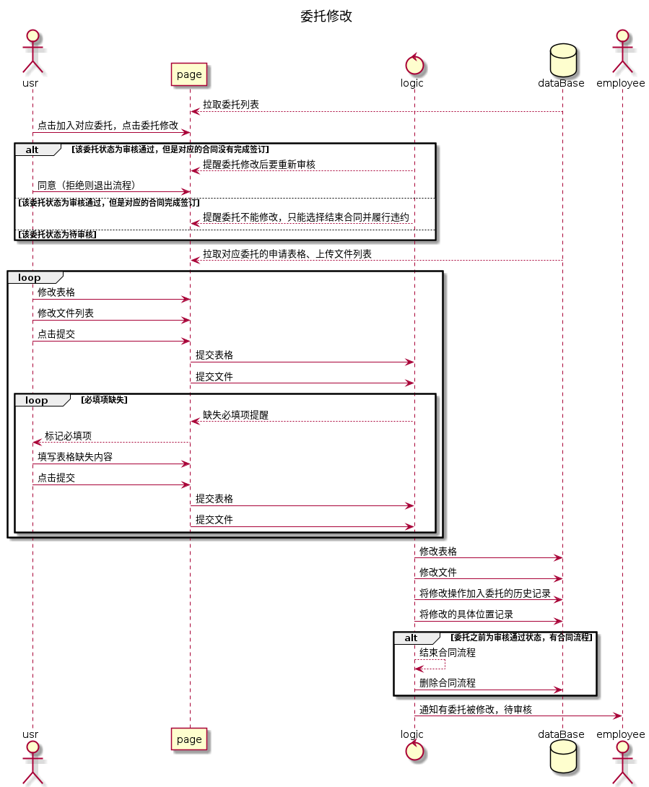
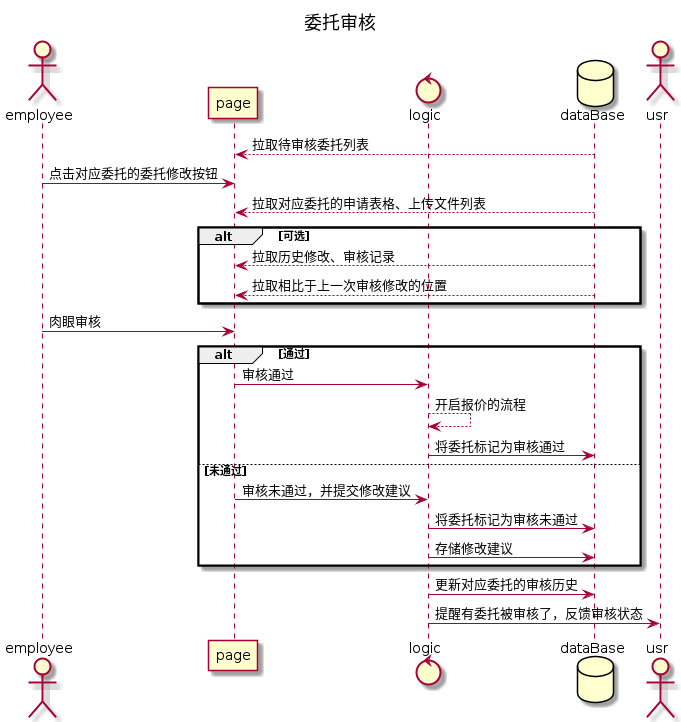
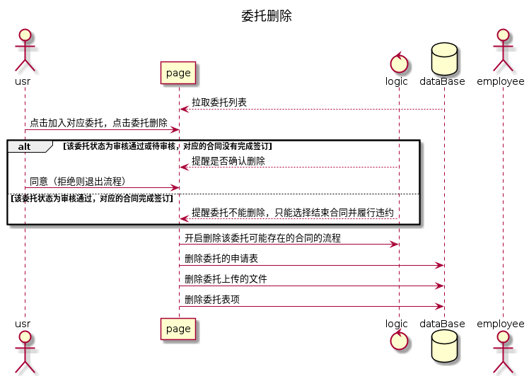
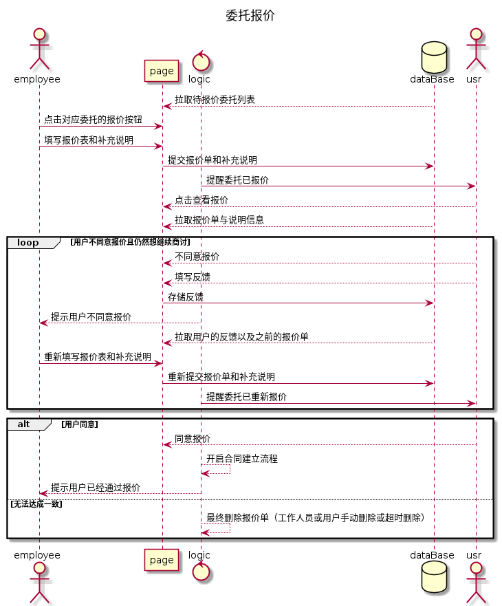
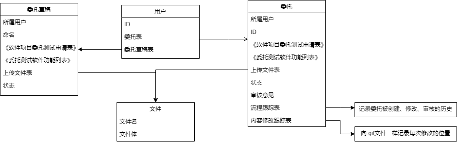

# 委托-需求用例描述表

## 用例描述表

| ID       | delegation.usrOperator.1                                     |
| -------- | ------------------------------------------------------------ |
| 名称     | 委托申请                                                     |
| 优先级   | 高                                                           |
| 参与者   | 用户、市场部工作人员                                         |
| 触发条件 | 用户登陆后，在个人主页点击进入委托申请                       |
| 前置条件 | 用户已登录                                                   |
| 后置条件 | 委托被保存到服务器，委托表格被保存到数据库；工作人员被提醒有新的委托，工作人员可以在后台展开委托审批了 |
| 正常流程 | 1. 点击委托申请后，看到委托申请页面（两张在线表格、文件上传入口、提交按钮、暂存按钮） 2. 填写两张表格《软件项目委托测试申请表》、《委托测试软件功能列表》 3. 上传文件：软件资料（包括《用户手册》、《安装手册》、《操作手册》、《维护手册》） 4. 点击提交 |
| 扩展流程 | 1.a 拉取用户的草稿列表 1.b 让用户选择使用哪一次的草稿或者空白表格开启新的委托 1.c 草稿列表有空间限制 2.a 用户填写表格一半后，点击暂存 2.b 表格在一段时间内自动保存一次 3.a 用户删除已经上传好的文件，取消上传 4.a 提交后，系统发现表项中有必填项没有填，提示提交失败 4.b 用户补全后重新提交 5 市场部的工作人员收到有新的委托的提醒 |
| 业务规则 |                                                              |
| 特殊需求 | 无                                                           |
| 依赖表   | NST－04－JS001－2018－软件项目委托测试提交材料.doc（向客户展示要填写的内容） NST－04－JS002－2018－软件项目委托测试申请表.docx（在线填写一部分是用户填写的，一部分是工作人员填写的，最后要签字，所以也要能生成pdf） NST－04－JS003－2018－委托测试软件功能列表.doc（在线填写） |

| ID       | delegation.usrOperator.2                                     |
| -------- | ------------------------------------------------------------ |
| 名称     | 委托修改                                                     |
| 优先级   | 高                                                           |
| 参与者   | 用户、市场部工作人员                                         |
| 触发条件 | 用户登陆后，在个人主页查看到自己的委托，点击一个具体的委托开始修改 |
| 前置条件 | 用户已登录、用户有已申请的委托                               |
| 后置条件 | 修改后的委托被保存至服务器；工作人员收到委托更新的提醒，可能需要重新审批 |
| 正常流程 | 1. 用户在想要修改的委托中，点击委托修改 2. 从数据库拉取对应委托的表格和上传文件列表并显示 3. 用户修改表格 4. 用户修改上传文件列表 5. 用户点击提交修改 |
| 扩展流程 | 1.a 已经审核通过的委托，需要提醒用户修改后要重新审核 1.b 已经签订合同的委托不能修改，如需修改需先撤销合同，线下履行违约义务 5.c 提交后，系统发现表项中有必填项没有填，提示修改失败 5.b 用户补全后重新提交 6. 市场部工作人员收到有委托修改的通知 7. 系统记录本次修改在哪些方面 8. 系统跟踪委托的创建、修改、审核历史 |
| 业务规则 |                                                              |
| 特殊需求 | 无                                                           |
| 依赖表   | NST－04－JS001－2018－软件项目委托测试提交材料.doc NST－04－JS002－2018－软件项目委托测试申请表.docx NST－04－JS003－2018－委托测试软件功能列表.doc |

| ID       | delegation.usrOperator.3                                     |
| -------- | ------------------------------------------------------------ |
| 名称     | 委托审核                                                     |
| 优先级   | 高                                                           |
| 参与者   | 用户、市场部工作人员                                         |
| 触发条件 | 市场部工作人员登陆后，打开带审核委托的列表，开始审核         |
| 前置条件 | 市场部工作人员登陆、有待审核委托                             |
| 后置条件 | 审核通过会导致委托状态变更，并进入到合同的流程；审核不同过，意见会被反馈给用户 |
| 正常流程 | 1. 工作人员拉取待审核委托列表 2. 对特定委托，点击委托审核 3. 拉取委托信息，人工审核 4. 点击审核通过 5. 该委托标记为审核通过，开启报价流程 |
| 扩展流程 | 2.a 拉取该委托之前的历史审核信息查看 4.a 审核不通过，填写审核意见 4.b 委托状态变为审核不通过，通知用户 4.c 用户查看审核意见，更改委托，再次待审或者撤销委托 |
| 业务规则 | 无                                                           |
| 特殊需求 | 无                                                           |
| 依赖表   | NST－04－JS001－2018－软件项目委托测试提交材料.doc NST－04－JS002－2018－软件项目委托测试申请表.docx NST－04－JS003－2018－委托测试软件功能列表.doc |

| ID       | delegation.usrOperator.4                                     |
| -------- | ------------------------------------------------------------ |
| 名称     | 委托删除                                                     |
| 优先级   | 高                                                           |
| 参与者   | 用户                                                         |
| 触发条件 | 用户查看自己的委托，决定删除某委托                           |
| 前置条件 | 用户登录、有已经申请的委托                                   |
| 后置条件 | 有委托被删除，可能导致该委托相关的流程也被删除               |
| 正常流程 | 1. 用户点击对应委托的委托删除 2. 系统提醒用户是否确认删除 3. 删除委托以及他相关的合同流程、提交的表单和文件 |
| 扩展流程 | 1.a 已经签订合同的委托不能修改，如需删除需先撤销合同，线下履行违约义务 |
| 业务规则 | 无                                                           |
| 特殊需求 | 无                                                           |
| 依赖表   | NST－04－JS001－2018－软件项目委托测试提交材料.doc NST－04－JS002－2018－软件项目委托测试申请表.docx NST－04－JS003－2018－委托测试软件功能列表.doc |

| ID       | delegation.usrOperator.5                                     |
| -------- | ------------------------------------------------------------ |
| 名称     | 委托报价                                                     |
| 优先级   | 高                                                           |
| 参与者   | 用户，市场部工作人员                                         |
| 触发条件 | 委托审核通过                                                 |
| 前置条件 | 有委托审核通过                                               |
| 后置条件 | 委托达成，开启合同建立；或者委托撤销                         |
| 正常流程 | 1. 工作人员点击对应委托的委托报价 2. 填写报价单及补充说明 3. 提交报价单及补充说明 4. 用户查看报价单及补充说明 5. 用户同意报价，开启合同建立流程 |
| 扩展流程 | 5.a 用户不同意报价单，填写反馈 5.b 工作人员收到报价单反馈通知 5.c 工作人员查看反馈，修改报价单及补充说明，转到4 6 最终没有达成一致，委托由用户删除、工作人员撤销或者超时撤销 |
| 业务规则 | 无                                                           |
| 特殊需求 | 无                                                           |
| 依赖表   | 报价单.docx（也是要签字的，所以也要生成pdf）                 |

**（下面两张表待更新，主要是没有报价的内容）**

## 需求描述表

| 需求ID              | 需求描述                                                     |
| ------------------- | ------------------------------------------------------------ |
| delegation.nouri.1  | 点击委托申请按钮后显示委托申请页面                           |
| delegation.uri.2    | 拉取用户的委托草稿列表                                       |
| delegation.uri.3    | 使用用户之前暂存的特定草稿填充表格                           |
| delegation.uri.4    | 将用户当前填写的表格作为新草稿暂存                           |
| delegation.uri.5    | 将用户当前填写的表格的草稿更新                               |
| delegation.nouri.6  | 定时自动保存用户填写的表格                                   |
| delegation.uri.7    | 删除用户的草稿                                               |
| delegation.nouri.8  | 草稿列表有空间限制                                           |
| delegation.uri.9    | 拉取用户委托列表                                             |
| delegation.uri.10   | 拉取某委托的申请表格、上传文件列表                           |
| delegation.uri.11   | 上传表格和文件并创建新的委托                                 |
| delegation.uri.12   | 上传用户的文件更新某委托的文件                               |
| delegation.uri.13   | 上传用户的表格更新某委托的表格                               |
| delegation.uri.14   | 对用户上传的表格进行完整性检查                               |
| delegation.nouri.15 | 通知市场部工作人员有新的委托到来                             |
| delegation.nouri.16 | 系统将该委托加入未处理委托的列表，供工作人员查看             |
| delegation.uri.17   | 市场部人员拉取待审核委托列表                                 |
| delegation.uri.18   | 审核通过某一委托                                             |
| delegation.uri.19   | 审核不通过某一委托，并提交审核意见                           |
| delegation.nouri.20 | 通知对应用户审核结果                                         |
| delegation.nouri.21 | 提醒用户审核通过的委托，修改后要重新审核；已经签合同的委托不能修改 |
| delegation.uri.22   | 拉取某委托的当前状态和审核意见                               |
| delegation.uri.23   | 拉取某委托的历史审核记录和审核意见                           |
| delegation.nouri.24 | 增加委托的本次修改历史                                       |
| delegation.nouri.25 | 增加委托的本次审核历史                                       |
| delegation.nouri.26 | 对委托修改中修改的位置做标记                                 |
| delegation.uri.27   | 拉取委托相比于上一次审核的版本的修改位置信息                 |
| delegation.uri.28   | 删除对应委托，以及委托的所有数据                             |
| delegation.nouri.29 | 提醒用户是否确定删除                                         |

| 需求ID              | 需求来源            | 需求实现难度 | 需求优先级 | 潜在风险 |
| ------------------- | ------------------- | ------------ | ---------- | -------- |
| delegation.nouri.1  | 用户                |              | 10         |          |
| delegation.uri.2    | 用户                |              | 6          |          |
| delegation.uri.3    | 用户                |              | 6          |          |
| delegation.uri.4    | 用户                |              | 6          |          |
| delegation.uri.5    | 用户                |              | 6          |          |
| delegation.nouri.6  | 用户                |              | 6          |          |
| delegation.uri.7    | 用户                |              | 6          |          |
| delegation.nouri.8  | 系统                |              | 4          |          |
| delegation.uri.9    | 用户/工作人员       |              | 10         |          |
| delegation.uri.10   | 用户/工作人员       |              | 10         |          |
| delegation.uri.11   | 用户                |              | 10         |          |
| delegation.uri.12   | 用户                |              | 10         |          |
| delegation.uri.13   | 用户                |              | 10         |          |
| delegation.uri.14   | 用户                |              | 8          |          |
| delegation.nouri.15 | 用户                |              | 8          |          |
| delegation.nouri.16 | 工作人员            |              | 8          |          |
| delegation.uri.17   | 市场部工作人员      |              | 10         |          |
| delegation.uri.18   | 市场部工作人员      |              | 10         |          |
| delegation.uri.19   | 市场部工作人员      |              | 10         |          |
| delegation.nouri.20 | 用户                |              | 8          |          |
| delegation.nouri.21 | 用户                |              | 8          |          |
| delegation.uri.22   | 用户                |              | 10         |          |
| delegation.uri.23   | 用户/市场部工作人员 |              | 8          |          |
| delegation.nouri.24 | 用户/市场部工作人员 |              | 8          |          |
| delegation.nouri.25 | 用户/市场部工作人员 |              | 8          |          |
| delegation.nouri.26 | 市场部工作人员      |              | 8          |          |
| delegation.uri.27   | 市场部工作人员      |              | 8          |          |
| delegation.uri.28   | 用户                |              | 10         |          |
| delegation.nouri.29 | 用户                |              | 10         |          |

## 图

