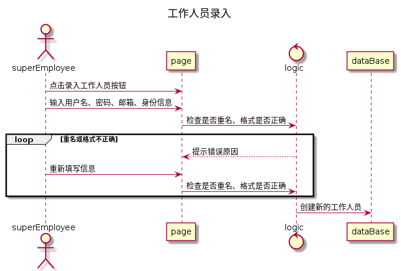

工作人员录入-需求用例表

| ID       | add.EmpOperator.1                                            |
| -------- | ------------------------------------------------------------ |
| 名称     | 工作人员录入                                                 |
| 优先级   | 高                                                           |
| 参与者   | 超级管理员                                                   |
| 触发条件 | 超级管理员登录后，想要创建新的工作人员                       |
| 前置条件 | 超级管理员已登录                                             |
| 后置条件 | 新的工作人员被创建                                           |
| 正常流程 | 1. 超级管理员登录 2. 点击添加工作人员 3. 输入用户名、密码、工作人员身份以及邮箱，点击录入 4. 录入成功 |
| 扩展流程 | 3.a 因为用户名重名而失败 3.b 因为格式错误而失败，如密码包含特殊字符、无此类身份信息 3.c 更改错误后重新提交 |
| 业务规则 | 无                                                           |
| 特殊需求 | 无                                                           |
| 依赖表   | 无                                                           |

