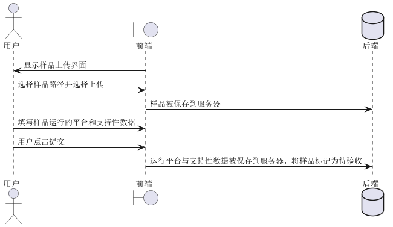
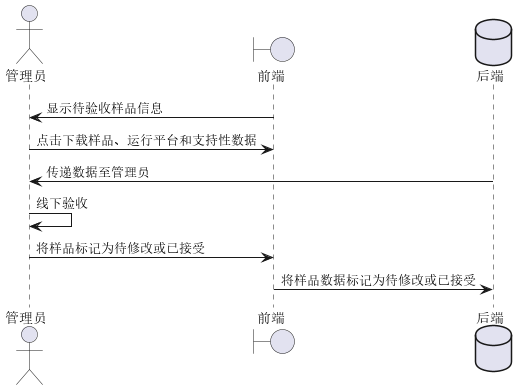
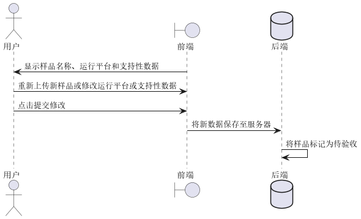
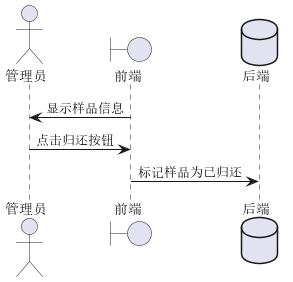
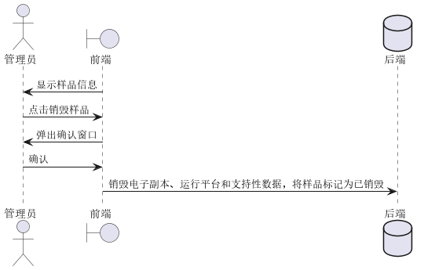
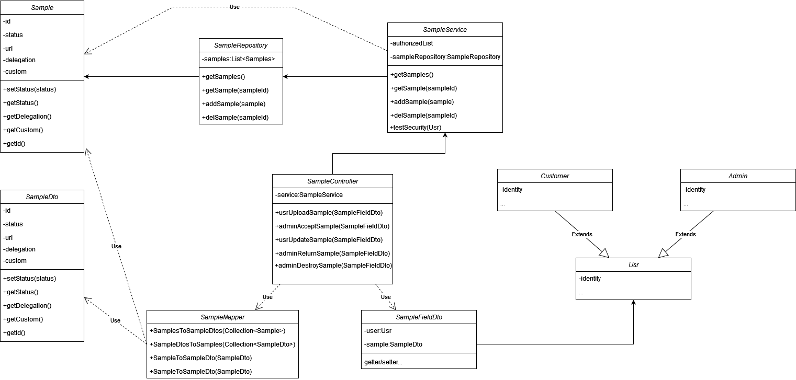

## 需求用例表

| ID       | SR-00                                |
| :------- | ------------------------------------ |
| 名称     | 用户上传样品                         |
| 优先级   | 高                                   |
| 参与者   | 用户                                 |
| 触发条件 | 用户进入样品上传模块 |
| 前置条件 | 合同签订完成，用户登录               |
| 后置条件 | 样品被保存到服务器               |
| 正常流程 | 1、系统显示样品上传界面            |
|  | 2、用户选择样本路径并选择上传，样品数据保存到服务器 |
|  | 3、用户填写样品运行的平台和支持性数据 |
|  | 4、用户点击提交，系统确认收到样品，3的数据被保存到服务器，并将样品标记为待验收 |
| 扩展流程 |                                      |
| 业务规则 |                                      |
| 特殊需求 |                                      |

| ID       | SR-01                                                        |
| :------- | ------------------------------------------------------------ |
| 名称     | 管理员验收样品                                               |
| 优先级   | 高                                                           |
| 参与者   | 管理员                                                       |
| 触发条件 | 管理员进入样品接收模块，点击获取样品                         |
| 前置条件 | 用户已上传样品，管理员已登录                                 |
| 后置条件 | 样品被标记为待验收                                           |
| 正常流程 | 1、系统显示待验收样品信息                                    |
|          | 2、管理员点击下载                                            |
|          | 3、系统将样品以及样品运行平台、支持性数据传递给管理员电脑    |
|          | 4、管理员将样本寄送至系统外的验收流程                        |
|          | 5、若验收失败，管理员点击待修改，将样品标记为待修改，并线下通知用户修改样品；否则管理员点击接受样品，系统将样品标记为已接受 |
| 扩展流程 |                                                              |
| 业务规则 |                                                              |
| 特殊需求 |                                                              |

| ID       | SR-02                                                        |
| :------- | ------------------------------------------------------------ |
| 名称     | 用户修改样品                                                 |
| 优先级   | 中                                                           |
| 参与者   | 用户                                                         |
| 触发条件 | 用户进入样品修改模块，并点击上传样品                         |
| 前置条件 | 样品被标记为待修改，用户已登录                               |
| 后置条件 | 样品被标记为待验收                                           |
| 正常流程 | 1、系统显示当前样品名称、运行平台和支持性数据，并提供下载和删除现有样品按钮 |
|          | 2、用户重新上传新样品或修改运行平台或支持性数据              |
|          | 3、用户点击提交修改                                          |
|          | 4、系统将新数据保存至服务器                                  |
|          | 5、系统将样品标记为待验收                                    |
| 扩展流程 |                                                              |
| 业务规则 |                                                              |
| 特殊需求 |                                                              |

| ID       | SR-03                                                        |
| :------- | ------------------------------------------------------------ |
| 名称     | 管理员归还样品                                               |
| 优先级   | 高                                                           |
| 参与者   | 管理员                                                       |
| 触发条件 | 管理员进入样品管理模块                                       |
| 前置条件 | 用户已上传样品，样品被标记为已验收，样品线下已归还，管理员已登录 |
| 后置条件 | 样品被标记为已归还                                           |
| 正常流程 | 1、系统显示样品信息                                          |
|          | 2、管理员点击归还按钮                                        |
|          | 3、样品被标记为已归还                                        |
| 扩展流程 |                                                              |
| 业务规则 |                                                              |
| 特殊需求 |                                                              |

| ID       | SR-04                                                        |
| :------- | ------------------------------------------------------------ |
| 名称     | 管理员销毁样品                                               |
| 优先级   | 高                                                           |
| 参与者   | 管理员                                                       |
| 触发条件 | 管理员进入样品管理模块                                       |
| 前置条件 | 用户已上传样品，管理员已登录                                 |
| 后置条件 | 样品被标记为已销毁，电子副本、运行平台和支持性数据被销毁     |
| 正常流程 | 1、系统显示样品信息                                          |
|          | 2、管理员点击销毁样品                                        |
|          | 3、系统弹出确认窗口                                          |
|          | 4、管理员确认                                                |
|          | 5、后端销毁电子副本、运行平台和支持性数据，标记样品为已销毁， |
| 扩展流程 |                                                              |
| 业务规则 |                                                              |
| 特殊需求 |                                                              |

## 类图

