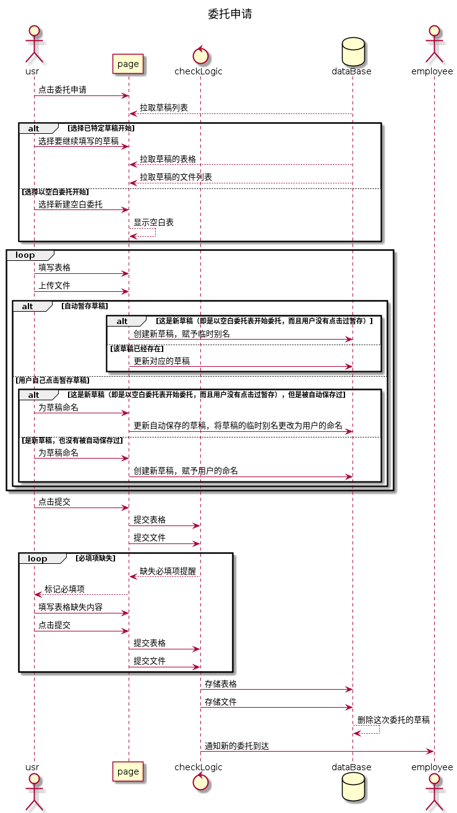

# 需求分析-软件测试流程简述-C组

刘昊坤 陈南曈 卢润邦 张乐简

15540761781

3368925785@qq.com

---

​	老师好，在着手设计接口之前，想请老师过目我们的流程设计，指出其中与需求不符合的地方。如果老师觉得现场讲解有必要，我们也可以采用线下会面或者线上视频会议的方式来向老师进行介绍。谢谢老师。

​	在对南大测试平台的需求分析中，我们将业务流程分为共15个操作，它们构成的完整流程如下（不包括用户注册与登录）：

​	`委托申请-->委托审核-->委托报价-->合同创建与审核-->用户上传样品-->管理员验收样品-->检测软件可测状态-->编写测试方案-->实施软件测试-->报告的生成与审核-->管理员归还样品`

​	此外，有委托修改、委托删除、用户修改样品、管理员销毁样品四个并非一定会经历的流程。

​	下面是流程的进一步描述，每个流程使用了一张用例描述表和一张uml顺序图来描述：

| ID       | delegation.usrOperator.1                                     |
| -------- | ------------------------------------------------------------ |
| 名称     | 委托申请                                                     |
| 优先级   | 高                                                           |
| 参与者   | 用户、市场部工作人员                                         |
| 触发条件 | 用户登陆后，在个人主页点击进入委托申请                       |
| 前置条件 | 用户已登录                                                   |
| 后置条件 | 委托被保存到服务器，委托表格被保存到数据库；工作人员被提醒有新的委托，工作人员可以在后台展开委托审批了 |
| 正常流程 | 1. 点击委托申请后，看到委托申请页面（两张在线表格、文件上传入口、提交按钮、暂存按钮） 2. 填写两张表格《软件项目委托测试申请表》、《委托测试软件功能列表》 3. 上传文件：软件资料（包括《用户手册》、《安装手册》、《操作手册》、《维护手册》） 4. 点击提交 |
| 扩展流程 | 1.a 拉取用户的草稿列表 1.b 让用户选择使用哪一次的草稿或者空白表格开启新的委托 1.c 草稿列表有空间限制 2.a 用户填写表格一半后，点击暂存 2.b 表格在一段时间内自动保存一次 3.a 用户删除已经上传好的文件，取消上传 4.a 提交后，系统发现表项中有必填项没有填，提示提交失败 4.b 用户补全后重新提交 5 市场部的工作人员收到有新的委托的提醒 |
| 业务规则 |                                                              |
| 特殊需求 | 无                                                           |

| ID       | delegation.usrOperator.2                                     |
| -------- | ------------------------------------------------------------ |
| 名称     | 委托修改                                                     |
| 优先级   | 高                                                           |
| 参与者   | 用户、市场部工作人员                                         |
| 触发条件 | 用户登陆后，在个人主页查看到自己的委托，点击一个具体的委托开始修改 |
| 前置条件 | 用户已登录、用户有已申请的委托                               |
| 后置条件 | 修改后的委托被保存至服务器；工作人员收到委托更新的提醒，可能需要重新审批 |
| 正常流程 | 1. 用户在想要修改的委托中，点击委托修改 2. 从数据库拉取对应委托的表格和上传文件列表并显示 3. 用户修改表格 4. 用户修改上传文件列表 5. 用户点击提交修改 |
| 扩展流程 | 1.a 已经审核通过的委托，需要提醒用户修改后要重新审核 1.b 已经签订合同的委托不能修改，如需修改需先撤销合同，线下履行违约义务 5.c 提交后，系统发现表项中有必填项没有填，提示修改失败 5.b 用户补全后重新提交 6. 市场部工作人员收到有委托修改的通知 7. 系统记录本次修改在哪些方面 8. 系统跟踪委托的创建、修改、审核历史 |
| 业务规则 |                                                              |
| 特殊需求 | 无                                                           |

| ID       | delegation.usrOperator.3                                     |
| -------- | ------------------------------------------------------------ |
| 名称     | 委托审核                                                     |
| 优先级   | 高                                                           |
| 参与者   | 用户、市场部工作人员                                         |
| 触发条件 | 市场部工作人员登陆后，打开带审核委托的列表，开始审核         |
| 前置条件 | 市场部工作人员登陆、有待审核委托                             |
| 后置条件 | 审核通过会导致委托状态变更，并进入到合同的流程；审核不同过，意见会被反馈给用户 |
| 正常流程 | 1. 工作人员拉取待审核委托列表 2. 对特定委托，点击委托审核 3. 拉取委托信息，人工审核 4. 点击审核通过 5. 该委托标记为审核通过，开启合同建立流程 |
| 扩展流程 | 2.a 拉取该委托之前的历史审核信息查看 4.a 审核不通过，填写审核意见 4.b 委托状态变为审核不通过，通知用户 4.c 用户查看审核意见，更改委托，再次待审或者撤销委托 |
| 业务规则 | 无                                                           |
| 特殊需求 | 无                                                           |

| ID       | delegation.usrOperator.4                                     |
| -------- | ------------------------------------------------------------ |
| 名称     | 委托删除                                                     |
| 优先级   | 高                                                           |
| 参与者   | 用户                                                         |
| 触发条件 | 用户查看自己的委托，决定删除某委托                           |
| 前置条件 | 用户登录、有已经申请的委托                                   |
| 后置条件 | 有委托被删除，可能导致该委托相关的流程也被删除               |
| 正常流程 | 1. 用户点击对应委托的委托删除 2. 系统提醒用户是否确认删除 3. 删除委托以及他相关的合同流程、提交的表单和文件 |
| 扩展流程 | 1.a 已经签订合同的委托不能修改，如需删除需先撤销合同，线下履行违约义务 |
| 业务规则 | 无                                                           |
| 特殊需求 | 无                                                           |

| ID       | delegation.usrOperator.5                                     |
| -------- | ------------------------------------------------------------ |
| 名称     | 委托报价                                                     |
| 优先级   | 高                                                           |
| 参与者   | 用户，市场部工作人员                                         |
| 触发条件 | 委托审核通过                                                 |
| 前置条件 | 有委托审核通过                                               |
| 后置条件 | 委托达成，开启合同建立；或者委托撤销                         |
| 正常流程 | 1. 工作人员点击对应委托的委托报价 2. 填写报价单及补充说明 3. 提交报价单及补充说明 4. 用户查看报价单及补充说明 5. 用户同意报价，开启合同建立流程 |
| 扩展流程 | 5.a 用户不同意报价单，填写反馈 5.b 工作人员收到报价单反馈通知 5.c 工作人员查看反馈，修改报价单及补充说明，转到4 6 最终没有达成一致，委托由用户删除、工作人员撤销或者超时撤销 |
| 业务规则 | 无                                                           |
| 特殊需求 | 无                                                           |

| ID       | contract.build.1                                |
| -------- | ----------------------------------------------- |
| 名称     | 合同创建、审核                                  |
| 参与者   | 用户，市场部，质检部                            |
| 触发条件 | 用户提交委托申请并被审核通过                    |
| 前置条件 | 对应委托已经申请却被审核通过                    |
| 正常流程 | 1.市场部起草合同草稿                            |
|          | 2.双方修改并核实该合同草稿                      |
|          | 3.质检部审查合同中测试项目的可行性，若不行返回2 |
|          | 4.三方确认后可以进行打印，带到线下进行签字      |
| 扩展流程 | 2.a 双方可以暂存修改                            |
| 业务规则 | 无                                              |

（样品的操作最终在一张顺序图上)

| ID       | SR-00                                                        |
| :------- | ------------------------------------------------------------ |
| 名称     | 用户上传样品                                                 |
| 优先级   | 高                                                           |
| 参与者   | 用户                                                         |
| 触发条件 | 用户进入样品上传模块                                         |
| 前置条件 | 合同签订完成，用户登录                                       |
| 后置条件 | 样品被保存到服务器                                           |
| 正常流程 | 1、系统显示样品上传界面                                      |
|          | 2、用户选择样本路径并选择上传，样品数据保存到服务器          |
|          | 3、用户填写样品运行的平台和支持性数据                        |
|          | 4、用户点击提交，系统确认收到样品，3的数据被保存到服务器，并将样品标记为待验收 |
| 扩展流程 |                                                              |
| 业务规则 |                                                              |
| 特殊需求 |                                                              |

| ID       | SR-01                                                        |
| :------- | ------------------------------------------------------------ |
| 名称     | 管理员验收样品                                               |
| 优先级   | 高                                                           |
| 参与者   | 管理员                                                       |
| 触发条件 | 管理员进入样品接收模块，点击获取样品                         |
| 前置条件 | 用户已上传样品，管理员已登录                                 |
| 后置条件 | 样品被标记为待验收                                           |
| 正常流程 | 1、系统显示待验收样品信息                                    |
|          | 2、管理员点击下载                                            |
|          | 3、系统将样品以及样品运行平台、支持性数据传递给管理员电脑    |
|          | 4、管理员将样本寄送至系统外的验收流程                        |
|          | 5、若验收失败，管理员点击待修改，将样品标记为待修改，并线下通知用户修改样品；否则管理员点击接受样品，系统将样品标记为已接受 |
| 扩展流程 |                                                              |
| 业务规则 |                                                              |
| 特殊需求 |                                                              |

| ID       | SR-02                                                        |
| :------- | ------------------------------------------------------------ |
| 名称     | 用户修改样品                                                 |
| 优先级   | 中                                                           |
| 参与者   | 用户                                                         |
| 触发条件 | 用户进入样品修改模块，并点击上传样品                         |
| 前置条件 | 样品被标记为待修改，用户已登录                               |
| 后置条件 | 样品被标记为待验收                                           |
| 正常流程 | 1、系统显示当前样品名称、运行平台和支持性数据，并提供下载和删除现有样品按钮 |
|          | 2、用户重新上传新样品或修改运行平台或支持性数据              |
|          | 3、用户点击提交修改                                          |
|          | 4、系统将新数据保存至服务器                                  |
|          | 5、系统将样品标记为待验收                                    |
| 扩展流程 |                                                              |
| 业务规则 |                                                              |
| 特殊需求 |                                                              |

| ID       | SR-03                                                        |
| :------- | ------------------------------------------------------------ |
| 名称     | 管理员归还样品                                               |
| 优先级   | 高                                                           |
| 参与者   | 管理员                                                       |
| 触发条件 | 管理员进入样品管理模块                                       |
| 前置条件 | 用户已上传样品，样品被标记为已验收，样品线下已归还，管理员已登录 |
| 后置条件 | 样品被标记为已归还                                           |
| 正常流程 | 1、系统显示样品信息                                          |
|          | 2、管理员点击归还按钮                                        |
|          | 3、样品被标记为已归还                                        |
| 扩展流程 |                                                              |
| 业务规则 |                                                              |
| 特殊需求 |                                                              |

| ID       | sample.admin.opr3                                            |
| -------- | ------------------------------------------------------------ |
| 名称     | 管理员销毁样品                                               |
| 优先级   | 高                                                           |
| 参与者   | 管理员                                                       |
| 触发条件 | 管理员进入样品管理模块                                       |
| 前置条件 | 用户已上传样品，管理员已登录                                 |
| 后置条件 | 样品被标记为已销毁，电子副本、运行平台和支持性数据被销毁     |
| 正常流程 | 1、系统显示样品信息                                          |
|          | 2、管理员点击销毁样品                                        |
|          | 3、系统弹出确认窗口                                          |
|          | 4、管理员确认                                                |
|          | 5、后端销毁电子副本、运行平台和支持性数据，标记样品为已销毁， |
| 扩展流程 |                                                              |
| 业务规则 |                                                              |
| 特殊需求 |                                                              |

| ID       | test.testEmplOperator.1                                      |
| -------- | ------------------------------------------------------------ |
| 名称     | 检查软件可测状态                                             |
| 优先级   | 高                                                           |
| 参与者   | 测试人员                                                     |
| 触发条件 | 测试人员进入测试项目页面，点击被测软件模块                   |
| 前置条件 | 客户上传软件样品，且被测软件状态为不可测                     |
| 后置条件 | 达到可测状态后测试项目中的被测软件状态变为可测               |
| 正常流程 | 1. 测试人员下载软件样品 2. 测试人员给客户编写反馈意见 3. 测试人员点击“拒绝接收”按钮 4. 测试人员点击“同意接收”按钮 |
| 拓展流程 | 0. 测试人员收到软件样品上传的通知                            |

| ID       | test.testEmplOperator.2                                      |
| -------- | ------------------------------------------------------------ |
| 名称     | 编写测试方案                                                 |
| 优先级   | 高                                                           |
| 参与者   | 测试人员                                                     |
| 触发条件 | 测试人员进入测试项目页面，点击测试方案模块                   |
| 前置条件 | 被测软件状态变为可测                                         |
| 后置条件 | 测试人员开始软件测试                                         |
| 正常流程 | 1. 测试人员填写测试方案  2. 测试人员点击“保存”按钮  3. 测试人员点击“提交”按钮  4. 测试人员填写测试方案评审表  5. 测试人员查看测试方案批准状态  6. 测试人员收到质量部反馈的修改意见 |
| 拓展流程 | 5.a 测试人员收到修改意见反馈的通知                           |

| ID       | test.testEmplOperator.3                                      |
| -------- | ------------------------------------------------------------ |
| 名称     | 实施软件测试                                                 |
| 优先级   | 高                                                           |
| 参与者   | 测试人员                                                     |
| 触发条件 | 测试人员进入测试项目页面，点击测试方案                       |
| 前置条件 | 测试方案通过                                                 |
| 后置条件 | 得到最终测试报告                                             |
| 正常流程 | 1. 测试人员下载被测软件  2. 测试人员下载项目支持文档（《用户手册》、《安装手册》、 《操作手册》、《维护手册》、《无法检测功能的声明》）  3. 测试人员填写测试用例  4. 测试人员在测试用例模块点击“保存”按钮  5. 测试人员填写测试记录  6. 测试人员在测试记录模块点击“保存”按钮  7. 测试人员填写问题清单  8. 测试人员在问题清单模块点击“保存”按钮  9. 测试人员在测试文档模块点击“提交”按钮  10. 测试人员下载测试报告  11. 测试人员点击“审核不通过”按钮  12. 测试人员点击“审核通过”按钮  13. 测试人员查看测试报告形式检查状态  14. 测试人员收到测试报告形式检查不通过的通知  15. 测试人员下载测试报告检查表  16. 测试人员收到测试报告形式检查通过的通知  17. 测试人员收到测试报告未批准签发的通知  18. 测试人员收到测试报告已批准签发的通知 |

| ID       | report.generate.1                                  |
| -------- | -------------------------------------------------- |
| 名称     | 报告生成                                           |
| 参与者   | 测试部                                             |
| 触发条件 | 项目测试完成                                       |
| 前置条件 | 项目测试完成                                       |
| 正常流程 | 1.测试部完善软件测试报告                           |
|          | 2.质检部审核软件测试报告质量，若通过转3，不通过转1 |
|          | 3.市场部发布软件测试报告                           |
| 扩展流程 | 1.a 完善过程可以暂存                               |
|          | 3.a 市场部可以召回报告                             |
| 业务规则 | 无                                                 |

