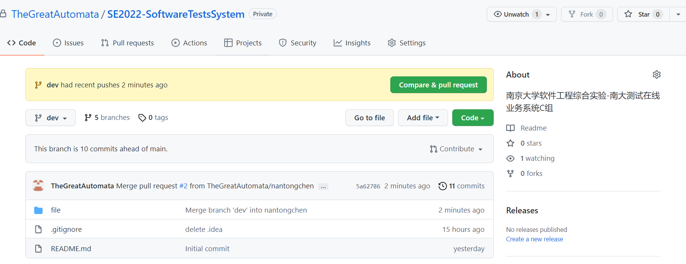
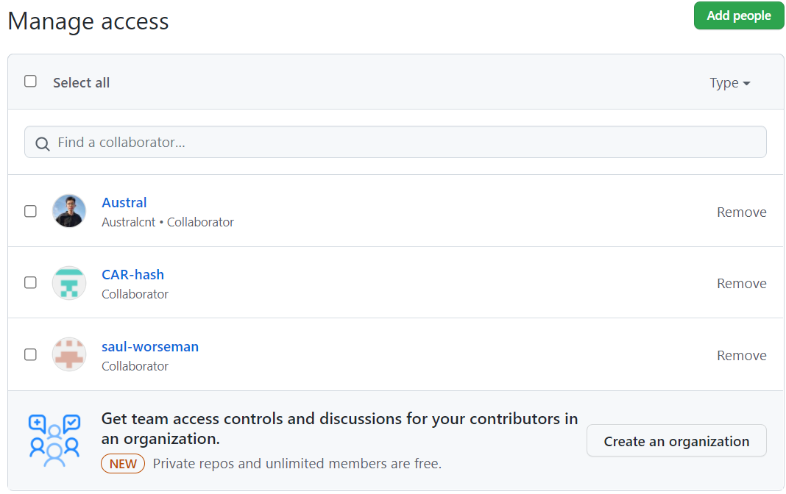
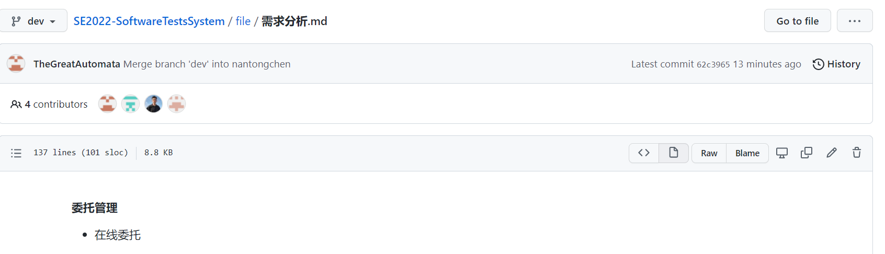

# 软工综合实验第一次课程汇报

2-测试中心管理系统-C组：刘昊坤、陈南曈、卢润邦、张乐简

## 1. 团队成员情况

### 刘昊坤

个人技能：

+ 算法功底扎实，熟悉数据结构；coding能力强，熟悉C++、Chisel、Verilog，了解Python、Cuda、SQL等；能在Linux下完成开发

+ 熟悉计算机网络原理，熟悉计算机网络分层模型、HTTP、TCP、IP等网络协议

+ 熟悉操作系统和计算机组成的基础知识，熟悉基础的处理器调度策略、页面置换策略、进程通信、ISA设计、流水线CPU设计等

+ 了解软件开发工业化流程，熟练使用协同开发工具Git

+ 文档编写：熟练使用Markdown，能用UML完成建模

### 陈南曈

个人技能：

+ C/C++：了解C++语言特性，掌握面向对象编程方法，熟练使用STL，能够使用C++编写千行代码级别项目

+ 数据库：了解数据库基础知识，掌握SQL语句编写，使用MySQL编写过简单实验

+ 其他语言：使用过Python，Verilog，QT等语言编写过课程项目

+ 协同开发工具：熟练使用Git

+ 文档编写：能够使用Markdown，会画UML图

### 卢润邦

个人技能：

+ Java基础：熟悉Java8基础知识，熟悉多线程并发，了解JVM原理，能独立进行一个小项目的开发。

+ cpp基础：了解C++的语言特性，熟练使用STL，能够用C++编写千行代码级别的简单项目。

+ 其他语言：会使用html，css，js进行非常简单的网页编写，有过python，verilog，QT的使用经历。

+ 数据库：掌握SQL语句的编写，了解数据库基础。使用过Mysql，了解redis

+ 工具：熟练使用Git、Maven、Gradle等项目管理及构建工具。

+ 文档编写：熟练掌握markdown，会画UML图以及时序图

### 张乐简

个人技能：

+ 了解软件设计模式，并可以熟练使用其中一些开发模式进行项目开发  

+ 数据库基础，可以使用Sql语言进行一定的数据库管理  

+ 对数据结构与算法有一定掌握  

+ 了解计算机网络的通信机制，对TCP/IP协议有一定的理解  

+ 能够使用Git等项目管理工具进行项目开发

## 2. 技术栈掌握情况

这是一个现代Web应用，根据对需求和开发框架的分析理解，我们认为需要的技术栈如下：

+ 主要开发语言
  + JAVA
+ Spring 全家桶
  + Spring Cloud 
  + Spring MVC
+ 数据库

  + MongoDB

  + Mysql
+ 测试工具

  + Junit
+ 展示工具

  + Swagger-UI
+ 构建工具

  + Maven
  + Gradle
+ 协同开发工具
  + Git

## 3. 团队成员分工情况

经过初步设计，将项目大致划分为四个部分：架构设计、功能完成、数据管理、项目测试。每位成员将交叉负责其中两个部分，分工如下：

+ 刘昊坤（组长）
  + 负责架构设计、功能完成
  + 负责需求分析汇总
+ 卢润邦
  + 负责架构设计，数据管理
+ 张乐简
  + 负责功能完成，项目测试
+ 陈南曈
  + 负责数据管理，项目测试

## 4. 协同开发方式

+ 建立了Github在线仓库：https://github.com/TheGreatAutomata/SE2022-SoftwareTestsSystem

  

  成员展示（已到齐）：

  

+ 协同开发方法：

  + main分支总是只包含已经开发成熟的部分
  + 开发在dev分支进行，每位成员创建自己的分支，完成自己的任务后，向远程仓库push
  + 组长负责将成员的分支合并到dev分支，并进行冲突处理
  + 在dev分支中的阶段性内容开发成熟后，将合并入main分支

+ 目前进行了协同开发实践，将各自负责的需求分析报告简要版本推送至远程仓库，综合为一份报告，进展顺利

  

## 5. 会议安排

+ 会议采用例会加紧急会议的方式。每周二晚七点和每周五晚七点开例会，遇到紧急情况召开紧急会议。会议形式为线下会议。
+ 会议一般包括接下来的任务计划和对上一周（或者一段时间）的工作总结。会议纪要将由小组成员轮流负责。
+ 目前已经进行过三次会议：
  + 3月22日周二晚的例行会议主要确认了初步需求分析的分工
  + 3月24日周四下午参加了曹春老师组织的需求分析会议，充实了需求分析的细节
  + 3月25日周五晚的例行会议总结了目前得到的需求分析报告，并制定了工作计划与成员分工

## 6. 初步的工作计划

+ 工作计划大致安排如下：
  + 第6~8周：进行需求分析，形成完整的需求分析报告；组内成员完成自己负责部分的技术栈学习
  + 第9~14周：编码工作开展阶段，前4周进行架构和数据库设计，后2周进行函数填充
  + 第15~16周：联调与测试阶段
  + 第17~18周：形成用户手册

+ 当前的工作进展情况：
  + 完成了需求分析方面的分工，向曹春老师进行了第一轮需求分析，并且找到了一份比较合适的商业需求分析报告作为参考
  + 梳理了项目技术栈，完成了分工，每位成员都可以开始学习自己对应的技术栈了。在B站等平台找到了优质的网课。

##  7. 目前主要困难

+ 对需求分析报告的内容、格式等还需要进一步研究。计划将找到的商业需求分析报告作为参考，边学习边构建自己的需求报告。
+ 技术栈的细节还需要进一步确定，比如具体使用Spring Cloud与Spring MVC中的哪些服务。

