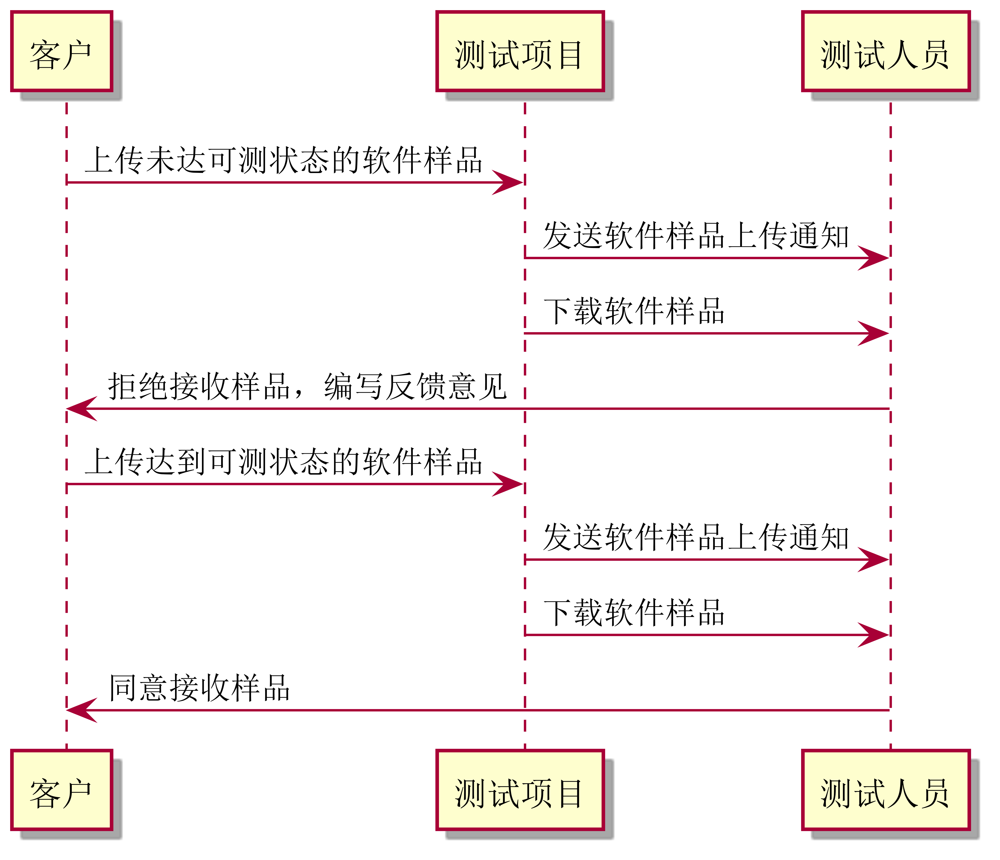
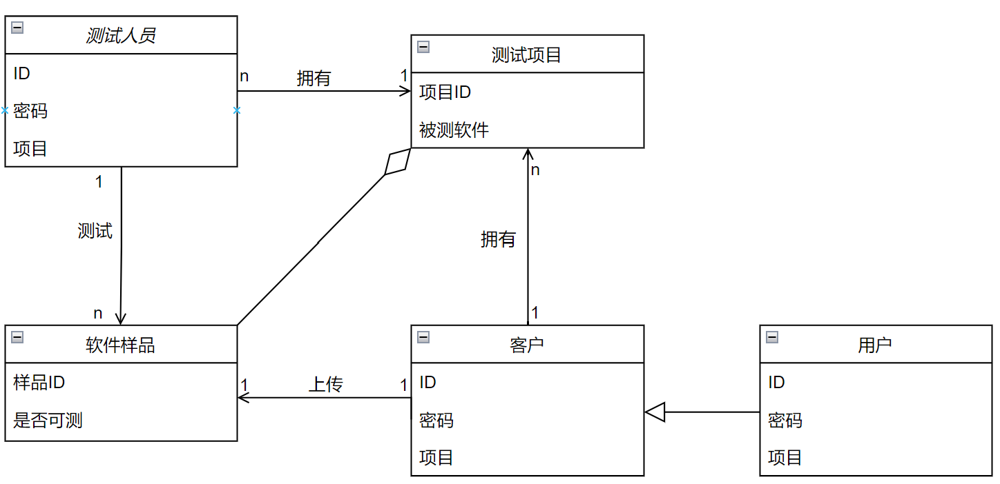

需求用例表

用例详细描述

| ID       | test.testEmplOperator.1                                      |
| -------- | ------------------------------------------------------------ |
| 名称     | 检查软件可测状态                                             |
| 优先级   | 高                                                           |
| 参与者   | 测试人员                                                     |
| 触发条件 | 测试人员进入测试项目页面，点击被测软件                       |
| 前置条件 | 客户上传软件样品，且被测软件状态为不可测                     |
| 后置条件 | 达到可测状态后测试项目中的被测软件状态变为可测               |
| 正常流程 | 1. 测试人员下载软件样品 2. 测试人员给客户编写反馈意见 3. 测试人员点击“拒绝接收”按钮 4. 测试人员点击“同意接收”按钮 |
| 拓展流程 | 0. 测试人员收到软件样品上传的通知                            |

测试人员需求

| 需求ID     | 需求描述                                       |
| ---------- | ---------------------------------------------- |
| test.uri.1 | 测试人员可以在通知栏收到客户上传软件样品的通知 |
| test.uri.2 | 测试人员可以下载客户上传的软件样品             |
| test.uri.3 | 测试人员可以给客户编写反馈意见                 |
| test.uri.4 | 测试人员可以点击“拒绝接受”按钮                 |
| test.uri.5 | 测试人员可以点击“同意接收”按钮                 |

需求跟踪矩阵

| 需求ID     | 需求来源 | 需求实现难度 | 优先级 | 潜在风险 |
| ---------- | -------- | ------------ | ------ | -------- |
| test.uri.1 | 测试人员 | 否           | 8      | 无       |
| test.uri.2 | 测试人员 | 否           | 10     | 无       |
| test.uri.3 | 测试人员 | 否           | 10     | 无       |
| test.uri.4 | 测试人员 | 否           | 10     | 无       |
| test.uri.5 | 测试人员 | 否           | 10     | 无       |

顺序图

类图

状态图

