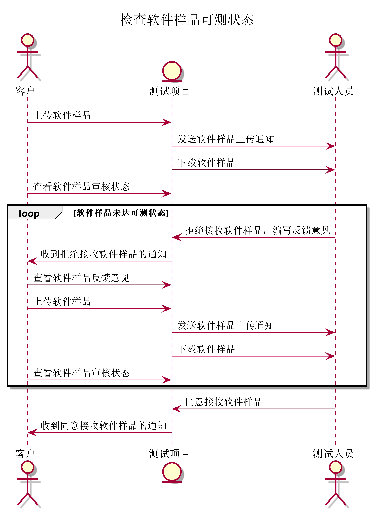
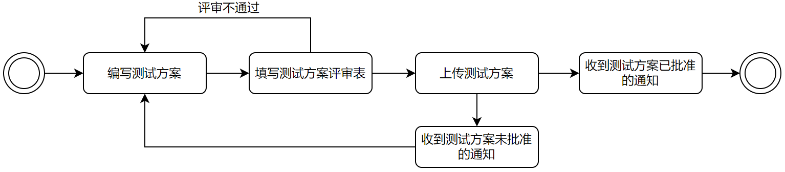

# 需求用例表

## 测试部分

##### 用例详细描述

| ID       | test.testEmplOperator.1                                      |
| -------- | ------------------------------------------------------------ |
| 名称     | 检查软件可测状态                                             |
| 优先级   | 高                                                           |
| 参与者   | 测试人员                                                     |
| 触发条件 | 测试人员进入测试项目页面，点击被测软件模块                   |
| 前置条件 | 客户上传软件样品，且被测软件状态为不可测                     |
| 后置条件 | 达到可测状态后测试项目中的被测软件状态变为可测               |
| 正常流程 | 1. 测试人员下载软件样品 2. 测试人员给客户编写反馈意见 3. 测试人员点击“拒绝接收”按钮 4. 测试人员点击“同意接收”按钮 |
| 拓展流程 | 0. 测试人员收到软件样品上传的通知                            |

##### 顺序图

##### 状态图

##### 用例详细描述

| ID       | test.testEmplOperator.2                                      |
| -------- | ------------------------------------------------------------ |
| 名称     | 编写测试方案                                                 |
| 优先级   | 高                                                           |
| 参与者   | 测试人员                                                     |
| 触发条件 | 测试人员进入测试项目页面，点击测试方案模块                   |
| 前置条件 | 被测软件状态变为可测                                         |
| 后置条件 | 测试人员开始软件测试                                         |
| 正常流程 | 1. 测试人员填写测试方案 2. 测试人员点击“保存”按钮 3. 测试人员点击“提交”按钮 4. 测试人员填写测试方案评审表 5. 测试人员查看测试方案批准状态 6. 测试人员收到质量部反馈的修改意见 |
| 拓展流程 | 5.a 测试人员收到修改意见反馈的通知                           |

##### 顺序图

##### 状态图

##### 用例详细描述

| ID       | test.testEmplOperator.3                                      |
| -------- | ------------------------------------------------------------ |
| 名称     | 实施软件测试                                                 |
| 优先级   | 高                                                           |
| 参与者   | 测试人员                                                     |
| 触发条件 | 测试人员进入测试项目页面，点击测试方案                       |
| 前置条件 | 测试方案通过                                                 |
| 后置条件 | 得到最终测试报告                                             |
| 正常流程 | 1. 测试人员下载被测软件 2. 测试人员下载项目支持文档（《用户手册》、《安装手册》、 《操作手册》、《维护手册》、《无法检测功能的声明》） 3. 测试人员填写测试用例 4. 测试人员在测试用例模块点击“保存”按钮 5. 测试人员填写测试记录 6. 测试人员在测试记录模块点击“保存”按钮 7. 测试人员填写问题清单 8. 测试人员在问题清单模块点击“保存”按钮 9. 测试人员在测试文档模块点击“提交”按钮 10. 测试人员下载测试报告 11. 测试人员点击“审核不通过”按钮 12. 测试人员点击“审核通过”按钮 13. 测试人员查看测试报告形式检查状态 14. 测试人员收到测试报告形式检查不通过的通知 15. 测试人员下载测试报告检查表 16. 测试人员收到测试报告形式检查通过的通知 17. 测试人员收到测试报告未批准签发的通知 18. 测试人员收到测试报告已批准签发的通知 |
| 拓展流程 |                                                              |

##### 顺序图

##### 状态图

##### 需求

| 需求ID      | 需求描述                                                     |
| ----------- | ------------------------------------------------------------ |
| test.uri.1  | 客户可以在测试项目中的软件样品模块上传软件样品               |
| test.uri.2  | 测试人员可以在通知栏中收到软件样品上传的通知                 |
| test.uri.3  | 测试人员可以在测试项目中下载上传的软件样品                   |
| test.uri.4  | 客户可以在测试项目的软件样品模块查看软件样品审核状态         |
| test.uri.5  | 测试人员可以在测试项目的软件样品模块中给客户编写反馈意见     |
| test.uri.6  | 测试人员可以在测试项目的软件样品模块点击“拒绝接收”按钮       |
| test.uri.7  | 客户可以在通知栏中收到软件样品反馈意见的通知                 |
| test.uri.8  | 客户可以在测试项目的软件样品模块中查看反馈意见               |
| test.uri.9  | 测试人员可以在测试项目的软件样品模块点击“同意接收”按钮       |
| test.uri.10 | 客户可以在通知栏中收到软件样品同意接收的通知                 |
| test.uri.11 | 测试人员可以在测试项目的测试方案模块填写测试方案             |
| test.uri.12 | 测试人员可以在测试项目的测试方案模块点击“保存”按钮           |
| test.uri.13 | 测试人员可以在测试项目的测试方案模块点击“提交”按钮           |
| test.uri.14 | 测试人员可以在测试项目的测试方案模块填写测试方案评审表       |
| test.uri.15 | 质量部人员可以在通知栏中收到测试方案上传的通知               |
| test.uri.16 | 质量部人员可以在测试方案模块下载上传的测试方案               |
| test.uri.17 | 测试人员可以在测试项目的测试方案模块查看测试方案批准状态     |
| test.uri.18 | 质量部人员可以在测试项目的测试方案模块给测试人员编写反馈意见 |
| test.uri.19 | 质量部人员可以在测试项目的测试方案模块点击“不批准”按钮       |
| test.uri.20 | 测试人员可以在通知栏中收到测试方案未被批准的通知             |
| test.uri.21 | 测试人员可以在测试项目的测试方案模块查看反馈意见             |
| test.uri.22 | 质量部人员可以在测试项目的测试方案模块点击“批准”按钮         |
| test.uri.23 | 测试人员可以在通知栏中收到测试方案已批准的通知               |
| test.uri.24 | 测试人员可以在测试项目的被测软件模块下载软件样品             |
| test.uri.25 | 测试人员可以在测试项目的项目支持文档模块下载项目支持文档     |
| test.uri.26 | 测试人员可以在测试项目的测试文档模块填写测试用例             |
| test.uri.27 | 测试人员可以在测试项目的测试文档模块填写测试用例后点击“保存”按钮 |
| test.uri.28 | 测试人员可以在测试项目的测试文档模块填写测试记录             |
| test.uri.29 | 测试人员可以在测试项目的测试文档模块填写测试记录后点击“保存”按钮 |
| test.uri.30 | 测试人员可以在测试项目的测试文档模块填写问题清单             |
| test.uri.31 | 测试人员可以在测试项目的测试文档模块填写问题清单后点击“保存”按钮 |
| test.uri.32 | 测试人员可以在测试项目的测试文档模块点击“提交”按钮           |
| test.uri.33 | 测试人员可以在测试项目的测试报告模块下载测试报告             |
| test.uri.34 | 测试人员可以在测试项目的测试报告模块审核测试报告             |
| test.uri.35 | 测试人员可以在测试项目的测试报告模块上传测试报告             |
| test.uri.36 | 质量部人员可以在通知栏中收到测试报告上传的通知               |
| test.uri.37 | 质量部人员可以在测试项目的测试报告模块下载测试报告           |
| test.uri.38 | 测试人员可以在测试项目的测试报告模块查看测试报告审核状态     |
| test.uri.39 | 质量部人员可以在测试项目的测试报告模块填写测试报告检查表     |
| test.uri.40 | 质量部人员可以在测试项目的测试报告模块点击“不通过”按钮       |
| test.uri.41 | 测试人员可以在通知栏中收到测试报告形式检查不通过的通知       |
| test.uri.42 | 测试人员可以在测试项目的测试报告模块下载测试报告检查表       |
| test.uri.43 | 质量部人员可以在测试项目的测试报告模块点击“通过”按钮         |
| test.uri.44 | 测试人员可以在通知栏中收到测试报告形式检查通过的通知         |
| test.uri.45 | 市场部人员可以在测试项目的测试报告模块拒绝批准签发测试报告   |
| test.uri.46 | 测试人员可以在通知栏中收到测试报告未批准签发的通知           |
| test.uri.47 | 市场部人员可以在测试项目的测试报告模块同意批准签发测试报告   |
| test.uri.48 | 测试人员可以在通知栏中收到测试报告已批准签发的通知           |

##### 需求跟踪矩阵

| 需求ID      | 需求来源   | 需求实现难度 | 优先级 | 潜在风险 |
| ----------- | ---------- | ------------ | ------ | -------- |
| test.uri.1  | 客户       | 否           | 10     | 无       |
| test.uri.2  | 测试人员   | 否           | 8      | 无       |
| test.uri.3  | 测试人员   | 否           | 10     | 无       |
| test.uri.4  | 客户       | 否           | 10     | 无       |
| test.uri.5  | 测试人员   | 否           | 10     | 无       |
| test.uri.6  | 测试人员   | 否           | 10     | 无       |
| test.uri.7  | 客户       | 否           | 8      | 无       |
| test.uri.8  | 客户       | 否           | 10     | 无       |
| test.uri.9  | 测试人员   | 否           | 10     | 无       |
| test.uri.10 | 客户       | 否           | 8      | 无       |
| test.uri.11 | 测试人员   | 否           | 10     | 无       |
| test.uri.12 | 测试人员   | 否           | 10     | 无       |
| test.uri.13 | 测试人员   | 否           | 10     | 无       |
| test.uri.14 | 测试人员   | 否           | 10     | 无       |
| test.uri.15 | 质量部人员 | 否           | 8      | 无       |
| test.uri.16 | 质量部人员 | 否           | 10     | 无       |
| test.uri.17 | 测试人员   | 否           | 10     | 无       |
| test.uri.18 | 质量部人员 | 否           | 10     | 无       |
| test.uri.19 | 质量部人员 | 否           | 10     | 无       |
| test.uri.20 | 测试人员   | 否           | 8      | 无       |
| test.uri.21 | 测试人员   | 否           | 10     | 无       |
| test.uri.22 | 质量部人员 | 否           | 10     | 无       |
| test.uri.23 | 测试人员   | 否           | 8      | 无       |
| test.uri.24 | 测试人员   | 否           | 10     | 无       |
| test.uri.25 | 测试人员   | 否           | 10     | 无       |
| test.uri.26 | 测试人员   | 否           | 10     | 无       |
| test.uri.27 | 测试人员   | 否           | 10     | 无       |
| test.uri.28 | 测试人员   | 否           | 10     | 无       |
| test.uri.29 | 测试人员   | 否           | 10     | 无       |
| test.uri.30 | 测试人员   | 否           | 10     | 无       |
| test.uri.31 | 测试人员   | 否           | 10     | 无       |
| test.uri.32 | 测试人员   | 否           | 10     | 无       |
| test.uri.33 | 测试人员   | 否           | 10     | 无       |
| test.uri.34 | 测试人员   | 否           | 10     | 无       |
| test.uri.35 | 测试人员   | 否           | 10     | 无       |
| test.uri.36 | 质量部人员 | 否           | 8      | 无       |
| test.uri.37 | 质量部人员 | 否           | 10     | 无       |
| test.uri.38 | 测试人员   | 否           | 10     | 无       |
| test.uri.39 | 质量部人员 | 否           | 10     | 无       |
| test.uri.40 | 质量部人员 | 否           | 10     | 无       |
| test.uri.41 | 测试人员   | 否           | 8      | 无       |
| test.uri.42 | 测试人员   | 否           | 10     | 无       |
| test.uri.43 | 质量部人员 | 否           | 10     | 无       |
| test.uri.44 | 测试人员   | 否           | 8      | 无       |
| test.uri.45 | 市场部人员 | 否           | 10     | 无       |
| test.uri.46 | 测试人员   | 否           | 8      | 无       |
| test.uri.47 | 市场部人员 | 否           | 10     | 无       |
| test.uri.48 | 测试人员   | 否           | 8      | 无       |

##### 类图

