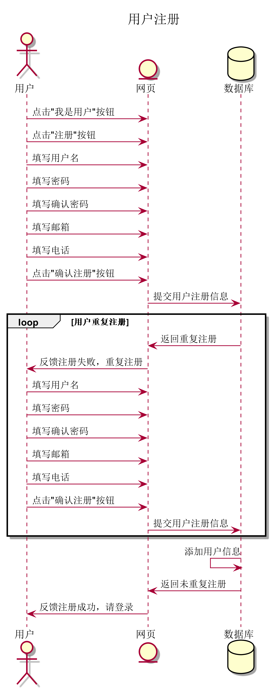
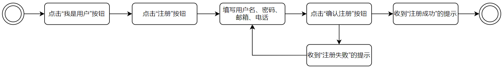
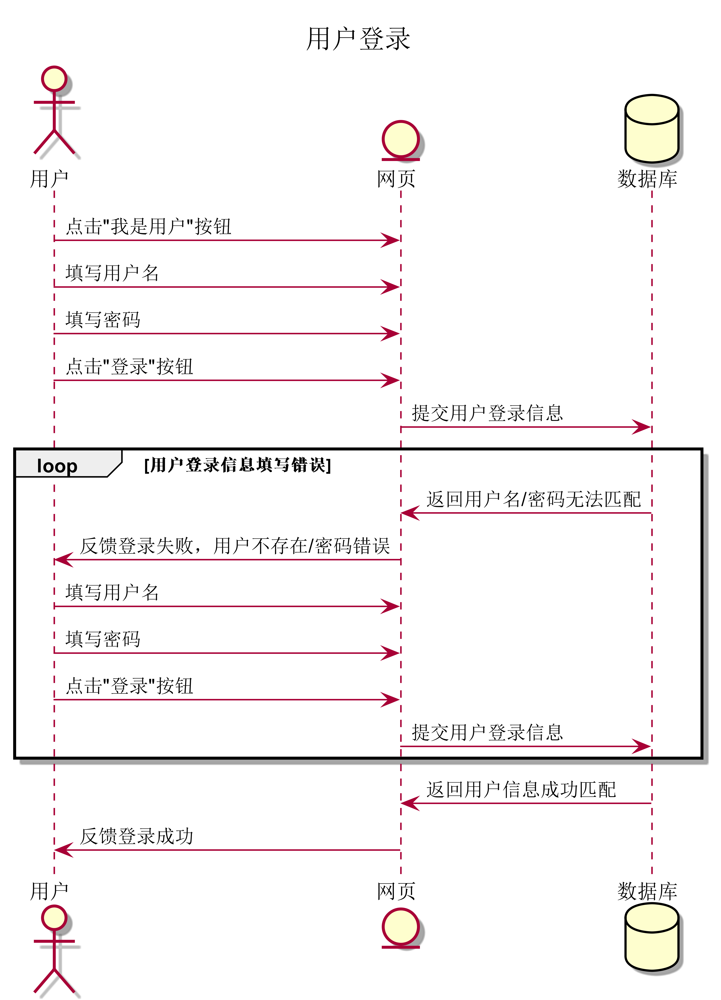
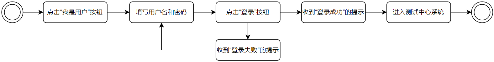
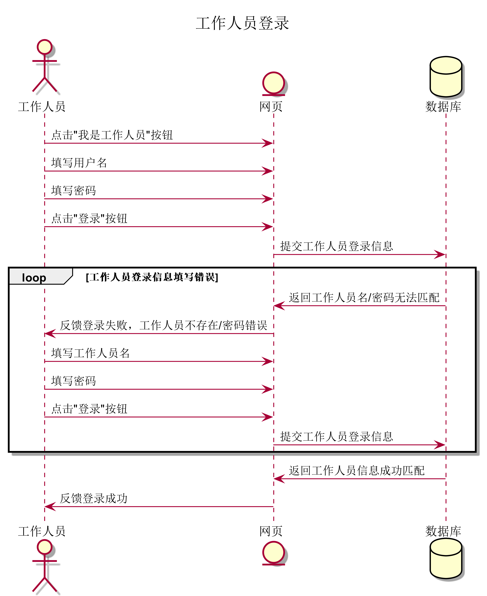
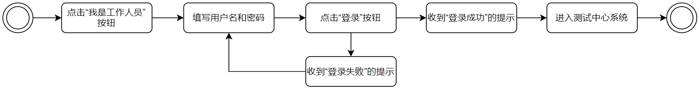

# 需求用例表

## 注册登录部分

##### 用例详细描述

| ID       | register.UsrOperator.1                                       |
| -------- | ------------------------------------------------------------ |
| 名称     | 用户注册                                                     |
| 优先级   | 高                                                           |
| 参与者   | 用户                                                         |
| 触发条件 | 用户打开测试中心网站                                         |
| 前置条件 | 用户此前未注册过                                             |
| 后置条件 | 用户注册成功                                                 |
| 正常流程 | 1. 用户点击“我是用户"按钮 2. 用户点击“注册”按钮 3. 用户填写用户名、密码、邮箱、电话 4. 用户点击“确认注册”按钮 5. 用户收到注册失败的提示 6. 用户收到注册成功的提示 |
| 拓展流程 | 3.a 若用户填写信息格式有误，立即在填写栏右侧反馈给用户       |
| 依赖表格 |                                                              |

##### 需求

| 需求ID            | 需求描述                                           |
| ----------------- | -------------------------------------------------- |
| usrRegister.uri.1 | 用户可以在登录/注册界面点击“我是用户”按钮          |
| usrRegister.uri.2 | 用户可以在登录/注册界面点击“注册”按钮              |
| usrRegister.uri.3 | 用户可以在用户注册界面填写用户名、密码、邮箱、电话 |
| usrRegister.uri.4 | 用户可以在用户注册界面“确认注册”按钮               |
| usrRegister.uri.5 | 用户可以在用户注册界面收到“注册失败”的提示         |
| usrRegister.uri.6 | 用户可以在用户注册界面收到“注册成功”的提示         |

##### 需求跟踪矩阵

| 需求ID            | 需求来源 | 需求实现难度 | 优先级 | 潜在风险 |
| ----------------- | -------- | ------------ | ------ | -------- |
| usrRegister.uri.1 | 用户     | 否           | 8      | 无       |
| usrRegister.uri.2 | 用户     | 否           | 10     | 无       |
| usrRegister.uri.3 | 用户     | 否           | 10     | 无       |
| usrRegister.uri.4 | 用户     | 否           | 10     | 无       |
| usrRegister.uri.5 | 用户     | 否           | 10     | 无       |
| usrRegister.uri.6 | 用户     | 否           | 10     | 无       |

##### 顺序图

##### 状态图

##### 用例详细描述

| ID       | login.UsrOperator.1                                          |
| -------- | ------------------------------------------------------------ |
| 名称     | 用户登录                                                     |
| 优先级   | 高                                                           |
| 参与者   | 用户                                                         |
| 触发条件 | 用户打开测试中心网站                                         |
| 前置条件 | 用户此前注册过                                               |
| 后置条件 | 用户登录成功，进入测试中心系统                               |
| 正常流程 | 1. 用户点击“我是用户"按钮 2. 用户填写用户名、密码 3. 用户点击“登录”按钮 4. 用户收到登录失败的提示 5. 用户收到登录成功的提示 6. 用户进入测试中心系统 |
| 拓展流程 |                                                              |
| 依赖表格 |                                                              |

##### 需求

| 需求ID         | 需求描述                                   |
| -------------- | ------------------------------------------ |
| usrLogin.uri.1 | 用户可以在登录/注册界面点击“我是用户”按钮  |
| usrLogin.uri.2 | 用户可以在用户登录界面填写用户名和密码     |
| usrLogin.uri.3 | 用户可以在用户登录界面“登录”按钮           |
| usrLogin.uri.4 | 用户可以在用户登录界面收到“登录失败”的提示 |
| usrLogin.uri.5 | 用户可以在用户登录界面收到“登录成功”的提示 |

##### 需求跟踪矩阵

| 需求ID         | 需求来源 | 需求实现难度 | 优先级 | 潜在风险 |
| -------------- | -------- | ------------ | ------ | -------- |
| usrLogin.uri.1 | 用户     | 否           | 8      | 无       |
| usrLogin.uri.2 | 用户     | 否           | 10     | 无       |
| usrLogin.uri.3 | 用户     | 否           | 10     | 无       |
| usrLogin.uri.4 | 用户     | 否           | 10     | 无       |
| usrLogin.uri.5 | 用户     | 否           | 10     | 无       |

##### 顺序图

##### 状态图

##### 用例详细描述

| ID       | login.EmpOperator.1                                          |
| -------- | ------------------------------------------------------------ |
| 名称     | 工作人员登录                                                 |
| 优先级   | 高                                                           |
| 参与者   | 工作人员                                                     |
| 触发条件 | 工作人员打开测试中心网站                                     |
| 前置条件 | 工作人员信息此前被超级管理员导入数据库                       |
| 后置条件 | 工作人员登录成功，进入测试中心系统                           |
| 正常流程 | 1. 工作人员点击“我是工作人员"按钮 2. 工作人员填写用户名、密码 3. 工作人员点击“登录”按钮 4. 工作人员收到登录失败的提示 5. 工作人员收到登录成功的提示 6. 工作人员进入测试中心系统 |
| 拓展流程 |                                                              |

##### 需求

| 需求ID         | 需求描述                                           |
| -------------- | -------------------------------------------------- |
| empLogin.uri.1 | 工作人员可以在登录/注册界面点击“我是工作人员”按钮  |
| empLogin.uri.2 | 工作人员可以在工作人员登录界面填写用户名和密码     |
| empLogin.uri.3 | 工作人员可以在工作人员登录界面“登录”按钮           |
| empLogin.uri.4 | 工作人员可以在工作人员登录界面收到“登录失败”的提示 |
| empLogin.uri.5 | 工作人员可以在工作人员登录界面收到“登录成功”的提示 |

##### 需求跟踪矩阵

| 需求ID         | 需求来源 | 需求实现难度 | 优先级 | 潜在风险 |
| -------------- | -------- | ------------ | ------ | -------- |
| empLogin.uri.1 | 工作人员 | 否           | 8      | 无       |
| empLogin.uri.2 | 工作人员 | 否           | 10     | 无       |
| empLogin.uri.3 | 工作人员 | 否           | 10     | 无       |
| empLogin.uri.4 | 工作人员 | 否           | 10     | 无       |
| empLogin.uri.5 | 工作人员 | 否           | 10     | 无       |

##### 顺序图

##### 状态图

