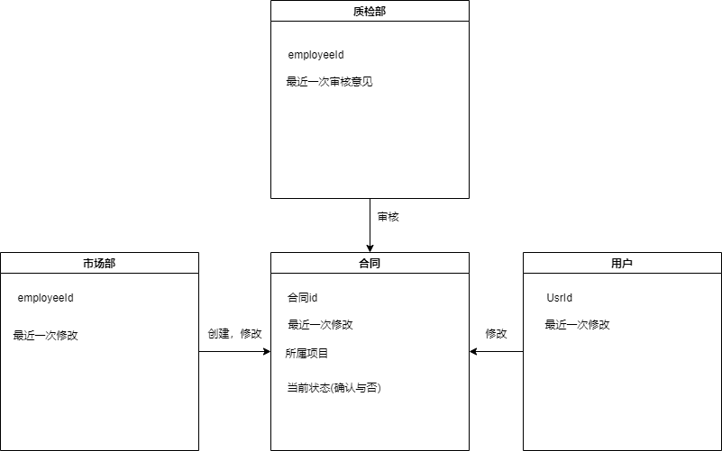

+ 业务操作

| ID       | contract.build.1                           |
| -------- | ------------------------------------------ |
| 名称     | 合同创建                                   |
| 参与者   | 用户，市场部                               |
| 触发条件 | 用户提交委托申请并被审核通过               |
| 前置条件 | 对应委托已经申请却被审核通过               |
| 正常流程 | 1.市场部起草合同草稿                       |
|          | 2.双方修改并核实该合同草稿                 |
|          | 3.双方确认后可以进行打印，带到线下进行签字 |
| 扩展流程 | 2.a 双方可以暂存修改                       |
| 业务规则 | 无                                         |

+ 需求

| 需求ID               | 需求描述                             |
| -------------------- | ------------------------------------ |
| contract.buildUri.1  | 市场部使用系统起草合同草稿           |
| contract.buildUri.2  | 用户使用系统修改合同草稿             |
| contract.buildUri.3  | 市场部使用系统修改合同草稿           |
| contract.buildUri.4  | 用户暂存修改的草稿                   |
| contract.buildUri.5  | 市场部暂存修改的草稿                 |
| contract.buildUri.6  | 用户确认合同草稿                     |
| contract.buildUri.7  | 市场部确认合同草稿                   |
| contract.buildUri.8  | 用户删除合同                         |
| contract.buildUri.9  | 市场部删除合同                       |
| contract.buildUri.10 | 市场部使用系统打印合同以带到线下交接 |

+ 需求跟踪矩阵

| 需求编号             | 需求类别 | 需求来源 | 难度 | 可行性 | 风险 | 改善产品功能 | 改善产品性能 | 增加用户满意度 | 增加产品竞争力 | 优先级 | 未实现原因 | 是否出现变更 | 变更基线 | 变更记录 |
| -------------------- | -------- | -------- | ---- | ------ | ---- | ------------ | ------------ | -------------- | -------------- | ------ | ---------- | ------------ | -------- | -------- |
| contract.buildUri.1  | 功能     | 用户     | 否   | 可     | 无   | 是           | 否           | 是             | 是             | 10     |            |              |          |          |
| contract.buildUri.2  | 功能     | 用户     | 否   | 可     | 无   | 是           | 否           | 是             | 是             | 10     |            |              |          |          |
| contract.buildUri.3  | 功能     | 用户     | 否   | 可     | 无   | 是           | 否           | 是             | 是             | 10     |            |              |          |          |
| contract.buildUri.4  | 功能     | 用户     | 否   | 可     | 无   | 是           | 否           | 是             | 是             | 1      |            |              |          |          |
| contract.buildUri.5  | 功能     | 用户     | 否   | 可     | 无   | 是           | 否           | 是             | 是             | 1      |            |              |          |          |
| contract.buildUri.6  | 功能     | 用户     | 否   | 可     | 无   | 是           | 否           | 是             | 是             | 10     |            |              |          |          |
| contract.buildUri.7  | 功能     | 用户     | 否   | 可     | 无   | 是           | 否           | 是             | 是             | 10     |            |              |          |          |
| contract.buildUri.8  | 功能     | 用户     | 否   | 可     | 无   | 是           | 否           | 是             | 是             | 10     |            |              |          |          |
| contract.buildUri.9  | 功能     | 用户     | 否   | 可     | 无   | 是           | 否           | 是             | 是             | 10     |            |              |          |          |
| contract.buildUri.10 | 功能     | 用户     | 否   | 可     | 无   | 是           | 否           | 是             | 是             | 10     |            |              |          |          |

+ 顺序图

  

+ 