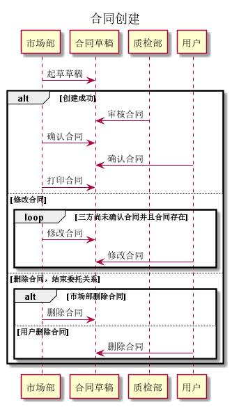
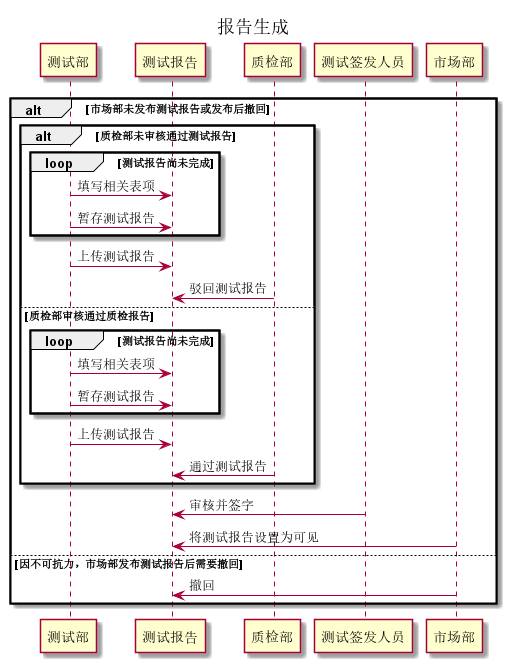

### 合同创建（合并进删除和修改）
+ 业务操作

| ID       | contract.build.1                                |
| -------- | ----------------------------------------------- |
| 名称     | 合同创建                                        |
| 参与者   | 用户，市场部，质检部                            |
| 触发条件 | 用户提交委托申请并被审核通过                    |
| 前置条件 | 对应委托已经申请却被审核通过                    |
| 正常流程 | 1.市场部起草合同草稿                            |
|          | 2.双方修改并核实该合同草稿                      |
|          | 3.质检部审查合同中测试项目的可行性，若不行返回2 |
|          | 4.三方确认后可以进行打印，带到线下进行签字      |
| 扩展流程 | 2.a 双方可以暂存修改                            |
| 业务规则 | 无                                              |

+ 需求

| 需求ID               | 需求描述                             |
| -------------------- | ------------------------------------ |
| contract.buildUri.1  | 市场部使用系统起草合同草稿           |
| contract.buildUri.2  | 用户使用系统修改合同草稿             |
| contract.buildUri.3  | 市场部使用系统修改合同草稿           |
| contract.buildUri.4  | 用户暂存修改的草稿                   |
| contract.buildUri.5  | 市场部暂存修改的草稿                 |
| contract.buildUri.6  | 用户确认合同草稿                     |
| contract.buildUri.7  | 市场部确认合同草稿                   |
| contract.buildUri.8  | 用户删除合同                         |
| contract.buildUri.9  | 市场部删除合同                       |
| contract.buildUri.10 | 市场部使用系统打印合同以带到线下交接 |
| contract.buildUri.11 | 质检部审核合同项目可行性             |

+ 需求跟踪矩阵

| 需求编号             | 需求类别 | 需求来源 | 难度 | 可行性 | 风险 | 改善产品功能 | 改善产品性能 | 增加用户满意度 | 增加产品竞争力 | 优先级 | 未实现原因 | 是否出现变更 | 变更基线 | 变更记录 |
| -------------------- | -------- | -------- | ---- | ------ | ---- | ------------ | ------------ | -------------- | -------------- | ------ | ---------- | ------------ | -------- | -------- |
| contract.buildUri.1  | 功能     | 乙方     | 否   | 可     | 无   | 是           | 否           | 是             | 是             | 10     |            |              |          |          |
| contract.buildUri.2  | 功能     | 甲方     | 否   | 可     | 无   | 是           | 否           | 是             | 是             | 10     |            |              |          |          |
| contract.buildUri.3  | 功能     | 乙方     | 否   | 可     | 无   | 是           | 否           | 是             | 是             | 10     |            |              |          |          |
| contract.buildUri.4  | 功能     | 乙方     | 否   | 可     | 无   | 是           | 否           | 是             | 是             | 1      |            |              |          |          |
| contract.buildUri.5  | 功能     | 乙方     | 否   | 可     | 无   | 是           | 否           | 是             | 是             | 1      |            |              |          |          |
| contract.buildUri.6  | 功能     | 甲方     | 否   | 可     | 无   | 是           | 否           | 是             | 是             | 10     |            |              |          |          |
| contract.buildUri.7  | 功能     | 乙方     | 否   | 可     | 无   | 是           | 否           | 是             | 是             | 10     |            |              |          |          |
| contract.buildUri.8  | 功能     | 甲方     | 否   | 可     | 无   | 是           | 否           | 是             | 是             | 10     |            |              |          |          |
| contract.buildUri.9  | 功能     | 乙方     | 否   | 可     | 无   | 是           | 否           | 是             | 是             | 10     |            |              |          |          |
| contract.buildUri.10 | 功能     | 乙方     | 否   | 可     | 无   | 是           | 否           | 是             | 是             | 10     |            |              |          |          |
| contract.buildUri.11 | 功能     | 乙方     | 否   | 可     | 无   | 是           | 否           | 是             | 是             | 10     |            |              |          |          |

+ 顺序图

  

+ 类图 

  

### 报告生成

+ 业务操作

| ID       | report.generate.1                                  |
| -------- | -------------------------------------------------- |
| 名称     | 报告生成                                           |
| 参与者   | 测试部                                             |
| 触发条件 | 项目测试完成                                       |
| 前置条件 | 项目测试完成                                       |
| 正常流程 | 1.测试部完善软件测试报告                           |
|          | 2.质检部审核软件测试报告质量，若通过转3，不通过转1 |
|          | 3.市场部发布软件测试报告                           |
| 扩展流程 | 1.a 完善过程可以暂存                               |
|          | 3.a 市场部可以召回报告                             |
| 业务规则 | 无                                                 |

+ 需求

| 需求ID             | 需求描述                               |
| ------------------ | -------------------------------------- |
| report.generate.1  | 测试部根据样品或者合同查找软件测试报告 |
| report.generate.2  | 测试部填写相关表项                     |
| report.generate.3  | 测试部暂存软件测试报告                 |
| report.generate.4  | 测试部上传软件测试报告                 |
| report.generate.5  | 质检部查看待处理报告                   |
| report.generate.6  | 质检部驳回报告                         |
| report.generate.7  | 质检部给出修改意见                     |
| report.generate.8  | 质检部通过报告                         |
| report.generate.9  | 市场部查看可发布报告                   |
| report.generate.10 | 市场部确认报告后将报告设置为用户可见   |
| report.generate.11 | 市场部撤回报告                         |

+ 需求跟踪矩阵

| 需求编号           | 需求类别 | 需求来源 | 难度 | 可行性 | 风险 | 改善产品功能 | 改善产品性能 | 增加用户满意度 | 增加产品竞争力 | 优先级 | 未实现原因 | 是否出现变更 | 变更基线 | 变更记录 |
| ------------------ | -------- | -------- | ---- | ------ | ---- | ------------ | ------------ | -------------- | -------------- | ------ | ---------- | ------------ | -------- | -------- |
| report.generate.1  | 功能     | 乙方     | 否   | 可     | 无   | 是           | 否           | 是             | 是             | 10     |            |              |          |          |
| report.generate.2  | 功能     | 乙方     | 否   | 可     | 无   | 是           | 否           | 是             | 是             | 10     |            |              |          |          |
| report.generate.3  | 功能     | 乙方     | 否   | 可     | 无   | 是           | 否           | 是             | 是             | 5      |            |              |          |          |
| report.generate.4  | 功能     | 乙方     | 否   | 可     | 无   | 是           | 否           | 是             | 是             | 10     |            |              |          |          |
| report.generate.5  | 功能     | 乙方     | 否   | 可     | 无   | 是           | 否           | 是             | 是             | 5      |            |              |          |          |
| report.generate.6  | 功能     | 乙方     | 否   | 可     | 无   | 是           | 否           | 是             | 是             | 10     |            |              |          |          |
| report.generate.7  | 功能     | 乙方     | 否   | 可     | 无   | 是           | 否           | 是             | 是             | 10     |            |              |          |          |
| report.generate.8  | 功能     | 乙方     | 否   | 可     | 无   | 是           | 否           | 是             | 是             | 10     |            |              |          |          |
| report.generate.9  | 功能     | 乙方     | 否   | 可     | 无   | 是           | 否           | 是             | 是             | 5      |            |              |          |          |
| report.generate.10 | 功能     | 乙方     | 否   | 可     | 无   | 是           | 否           | 是             | 是             | 10     |            |              |          |          |
| report.generate.11 | 功能     | 乙方     | 否   | 可     | 无   | 是           | 否           | 是             | 是             | 1      |            |              |          |          |

+ 顺序图

+ 类图

